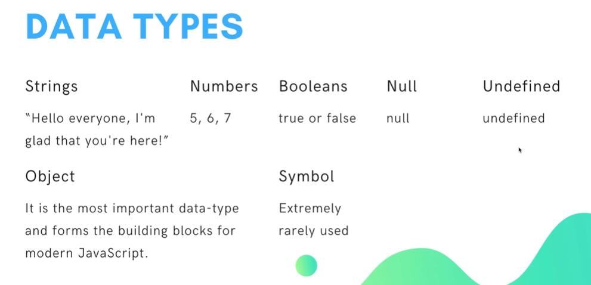

# Javascript
Way To Learn Javascript

Variable Naming :-
  - [x] The name should be unique
  - [x] The name should not be any reserved keyword
  - [x] The name must start with a letter, underscore or dollar sign
  - [x] The name can only contain letters, numbers, underscores and dollar signs
  - [x] The name are case sensitive (y and Y are different variables)

Data Types:-

Operators
  - [x] Arithmetic Operators
  - [x] Assignment Operators
  - [x] Comparison Operators
  - [x] Logical Operators
  - [x] Bitwise Operators
  - [x] String Operators
  - [x] Conditional (Ternary) Operator
  - [x] Comma Operator
  - [x] Unary Operators
  - [x] Relational Operators
  - [x] Equality Operators

 
 1. Arithmetic Operators
  - [x] +	Addition
  - [x] Subtraction
  - [x] *	Multiplication
  - [x] /	Division
  - [x] %	Modulus
  - [x] ++	Increment
  - [x] --	Decrement

 2. Assignment Operators
  - [x] =	x = y	x = y
  - [x] +=	x += y	x = x + y
  - [x] -=	x -= y	x = x - y
  - [x] *=	x *= y	x = x * y
  - [x] /=	x /= y	x = x / y
  - [x] %=	x %= y	x = x % y
  - [x] **=	x **= y	x = x ** y

 3. Comparison Operators
  - [x] ==	Equal to	x == y
  - [x] ==	Equal to	x == y
  - [x] ===	Equal value and equal type	x === y
  - [x] !=	Not equal	x != y
  - [x] !==	Not equal value or not equal type	x !== y
  - [x] >	Greater than	x > y
  - [x] <	 Less than	x < y
  - [x] >=	Greater than or equal to	x >= y
  - [x] <=	Less than or equal to	x <= y
  - [x] ?	ternary operator

 4. Logical Operators
  - [x] &&	Logical and	Returns true if both statements are true	x < 10 &&  x < 20
  - [x] ||	Logical or	Returns true if one of the statements is true	x < 10 || x < 5
  - [x] !	Logical not	Reverse the result, returns false if the result is true	!(x < 5 && x < 10)

 5. Bitwise Operators
  - [x] &	AND	Sets each bit to 1 if both bits are 1
  - [x] |	OR	Sets each bit to 1 if one of two bits is 1
  - [x] ^	XOR	Sets each bit to 1 if only one of two bits is 1
  - [x] ~	NOT	Inverts all the bits
  - [x] <<	Zero fill left shift	Shift left by pushing zeros in from the right and let the leftmost bits fall off

 6. String Operators
  - [x] +	Addition	Adds together two strings
  - [x] +=	Addition assignment	Adds the right operand to the left operand and assigns the result to the left operand

 7. Conditional (Ternary) Operator
  - [x] condition ? expr1 : expr2

 8. Comma Operator
  - [x] ,	Comma Operator	Evaluates each of its operands (from left to right) and returns the value of the last operand

 9. Unary Operators
  - [x] typeof	Returns the type of a variable
  - [x] delete	Deletes an object property
  - [x] void	Indicates that the expression should not be evaluated
  - [x] +	Unary plus	Tries to convert the operand to a number, if it is not already
  - [x] Unary negation	Tries to convert the operand to a number, if it is not already
  - [x] !	Logical not	Reverses the sense of its operand
  - [x] ~	Bitwise not	Inverts all the bits in its operand
  - [x] ++	Increment	Adds one to its operand
  - [x] --	Decrement	Subtracts one from its operand
  - [x] ++	Postfix increment	Adds one to its operand
  - [x] --	Postfix decrement	Subtracts one from its operand
  - [x] new	Creates an instance of a user-defined object type or of one of the built-in object types that has a constructor function

 10. Relational Operators
  - [x] in	Returns true if the specified property is in the specified object
  - [x] instanceof	Returns true if the specified object is of the specified object type

 11. Equality Operators
  - [x] ==	Equal to	x == y
  - [x] ===	Equal value and equal type	x === y
  - [x] !=	Not equal	x != y
  - [x] !==	Not equal value or not equal type	x !== y
